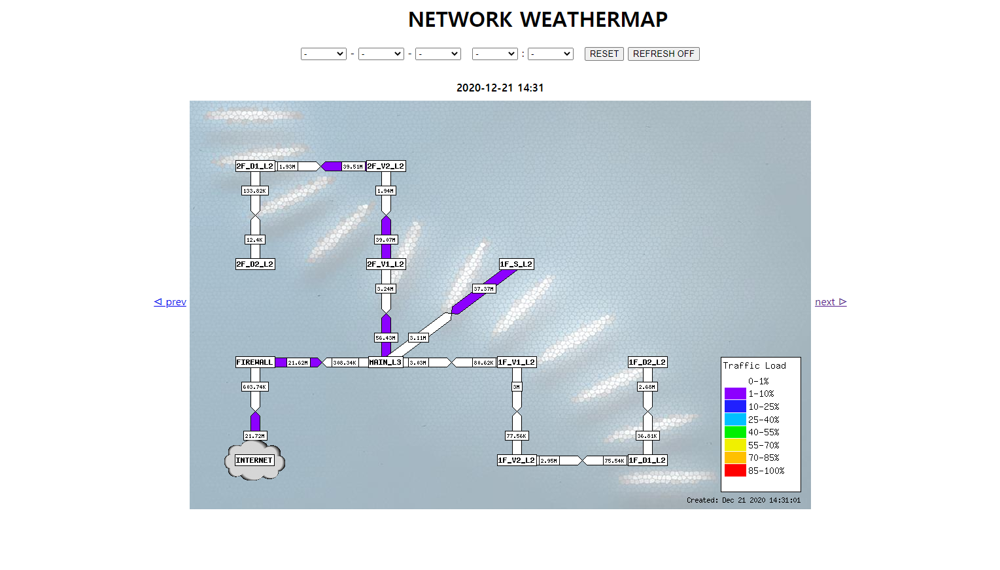
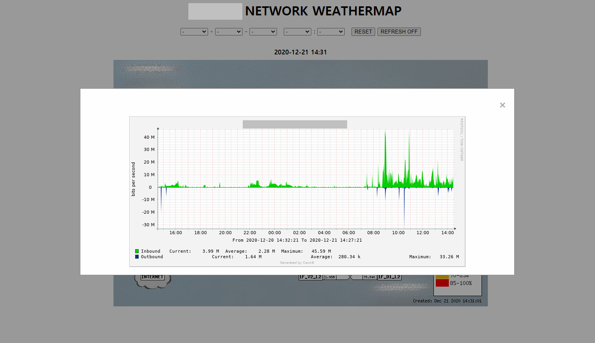

# PHPWeathermap-Viewer

PHP-Weathermap을 Stand-alone으로 동작 시킬 때 웹 상에서 보기 좋게 보여주는 Flask 기반 웹 UI 입니다.

## UI 예제


## MAP 적용 UI 예제



# 사용법

## 00. 시작하기 전에
본 사용법에서는 "/var/www/weathermap" 디렉토리를 설치 장소로 사용합니다.

## 01. 다운로드 및 압축해제
해당 코드를 다운로드 받아서 압축해제 합니다.

```
tar xvf phpweathermap-viewer-master.tar
```

압축을 해제한 후 원하는 폴더로 이동 시킵니다.

```
mv phpweathermap-viewer-master /var/www/weathermap
```

위의 명령어를 완료하면 아래와 같은 폴더 구조가 생성됩니다.

```
/var/www/weathermap
├── README.md
├── app
│   ├── __init__.py
│   ├── config.py
│   ├── static
│   │   ├── css
│   │   │   └── main.css
│   │   ├── image
│   │   └── js
│   │       └── main.js
│   └── templates
│       └── index.html
├── run.py
├── sample
│   ├── 01.png
│   ├── 02.png
│   ├── main_1.png
│   └── main_2.png
└── weathermap.wsgi
```

## 02. PHP Weathermap 생성 스크립트 작성

PHP Weathermap을 이용하여 /var/www/weathermap/app/static/image 폴더에 png 파일을 생성하여야 합니다.

이를 위해서 아래와 같은 스크립트를 사용하여 주기적으로 동작하도록 crond에 등록합니다.

먼저 스크립트를 작성합니다. 스크립트 파일명은 원하시는 것으로 정하시면 됩니다. 여기서는 create\_weathermap.sh로 정합니다.

```
vim create_weathermap.sh
```

```
#!/bin/bash

## PHP Weathermap 설치 위치
BASE_DIR="[PHP WEATHERMAP 설치 디렉토리 위치]"

## 이미지를 저장할 위치
OUTPUT_DIR="/var/www/weathermap/app/static/image"

## 설정 파일 위치
CONFIG_DIR="[PHP WEATERMAP 설정 파일 위치]"

## 실행 시간 기준 디렉토리명 파일명 생성
datestamp=`date "+%Y-%m-%d"`
timestamp=`date "+%Y-%m-%d_%H:%M"`

## 실제 디렉토리 생성
mkdir ${OUTPUT_DIR}/${datestamp}

cd ${BASE_DIR}

## 웨더맵 생성
./weathermap --config ${CONFIG_DIR} --output ${OUTPUT_DIR}/${datestamp}/${timestamp}.png
```

해당 파일은 원하시는 곳에 두고 실행 권한을 줍니다.

```
chmod +x create_weathermap.sh
```

해당 파일을 crontab에 등록 합니다.

```
crontab -e
```

```
*/1 * * * * [실행 파일명 위치]/create_weathermap.sh > /dev/null 2>&1
```

1분 후에 해당 폴더로 이동하여 파일이 생성되었는지 확인합니다.

아래와 같이 이미지 파일이 생성되었다면 성공입니다.

```
├── app
│   ├── __init__.py
│   ├── config.py
│   ├── static
│   │   ├── css
│   │   │   └── main.css
│   │   ├── image
│   │   │   └── 2020-12-23
│   │   │       ├── 2020-12-23_15:25.png
│   │   │       ├── 2020-12-23_15:26.png
│   │   │       ├── 2020-12-23_15:27.png
│   │   │       ├── 2020-12-23_15:28.png
│   │   │       ├── 2020-12-23_15:29.png
│   │   │       ├── 2020-12-23_15:30.png
│   │   │       ├── 2020-12-23_15:31.png
│   │   │       ├── 2020-12-23_15:32.png
│   │   │       ├── 2020-12-23_15:33.png
│   │   │       ├── 2020-12-23_15:34.png
│   │   │       ├── 2020-12-23_15:35.png
│   │   │       ├── 2020-12-23_15:36.png
│   │   │       ├── 2020-12-23_15:37.png
│   │   │       ├── 2020-12-23_15:38.png
│   │   │       ├── 2020-12-23_15:39.png
│   │   │       ├── 2020-12-23_15:40.png
│   │   │       ├── 2020-12-23_15:41.png
│   │   │       ├── 2020-12-23_15:42.png
│   │   │       ├── 2020-12-23_15:43.png
│   │   │       └── 2020-12-23_15:44.png
│   │   └── js
│   │       └── main.js
│   └── templates
│       ├── dashboard.html
│       └── index.html
├── run.py
└── weathermap.wsgi
```

## 03. 설정 파일 수정

아래와 같이 기본 설정 파일을 수정합니다.

```
vim /var/www/weathermap/app/config.py
```

```
TITLE = """페이지에 표시될 타이틀"""
IMAGE_PATH = """/var/www/weathermap/app/static/image"""
MAP_BASE_URL = """"""
MAP_DATA = []
```

MAP\_BASE\_URL과 MAP\_DATA는 MAP과 AREA 태그를 사용하여, 그래프를 볼 수 있게 만드는 경우에만 사용합니다.

Apache2 혹은 기타 엔진을 이용하기 위해 wsgi 설정을 진행합니다.

파일을 열어 아래와 같이 수정합니다.

```
#!/usr/bin/python3
import sys
sys.path.insert(0, "/var/www/weathermap")
from app import app as application
```
```
vim /var/www/weathermap/weathermap.wsgi
```

## 04. Apache2 와 연동하기

```
해당 항목은 flask, apache2 연동 관련 문서 검색으로 가능합니다.
```

## EXT. MAP, AREA 태그를 사용하여 cacti 그래프 보이게 하기

### cacti, guest 사용자 설정하기
cacti 설정화면에서 인증탭으로 이동하여, 일반사용자를 "guest"로 설정합니다.


### cacti, 사용자 로그아웃하고 그래프 확인하기

먼저 그래프 ID를 알아야 합니다.

cacti 에서 "관리" -> "그래프" 로 들어가서 그래프를 선택하시고 위의 주소창을 보시면

```
http://[cacti 접속주소]/graphs.php?action=graph_edit&id=72
```
를 확인할 수 있습니다. 해당 주소의 마지막 id 값을 확인 합니다. 여기서는 72번 입니다. 확인하셨으면 로그아웃 합니다.

로그아웃 하고 해당 아이디 값을 이용하여 아래 주소를 생성합니다.

```
http://[cacti 접속주소]/graph_image.php?local_graph_id=72
```

위의 링크로 접속하였을 때 아래와 같이 결과가 나오면 정상적으로 설정된 것입니다.


### 설정파일 수정으로 MAP 정보 입히기

설정 파일을 열어서 아래와 같이 추가해줍니다.

```
vim /var/www/weathermap/app/config.py
```

```
.
.
.
MAP_BASE_URL = """http://[cacti 접속 주소]/graph_image.php?local_graph_id="""
MAP_DATA = []
MAP_DATA.append( ( "[AREA TYPE]", "[COORDS]", "[그래프 ID]") )
```

해당 설정에서 AREA TYPE, COORDS는 HTML area 태그를 참조하여 작성하시면 됩니다.

